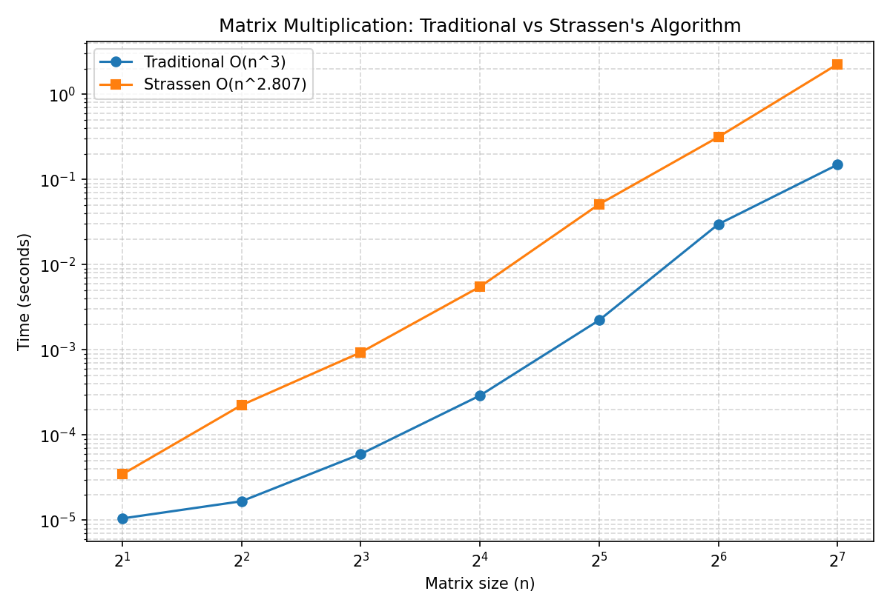
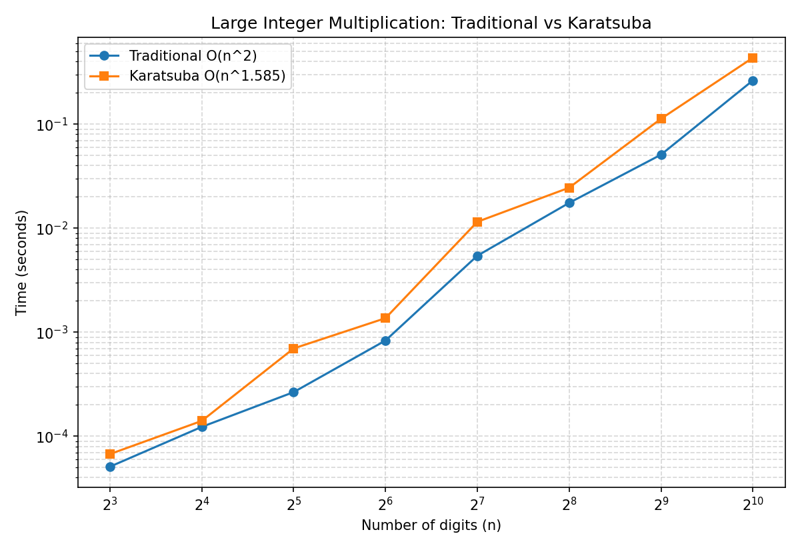
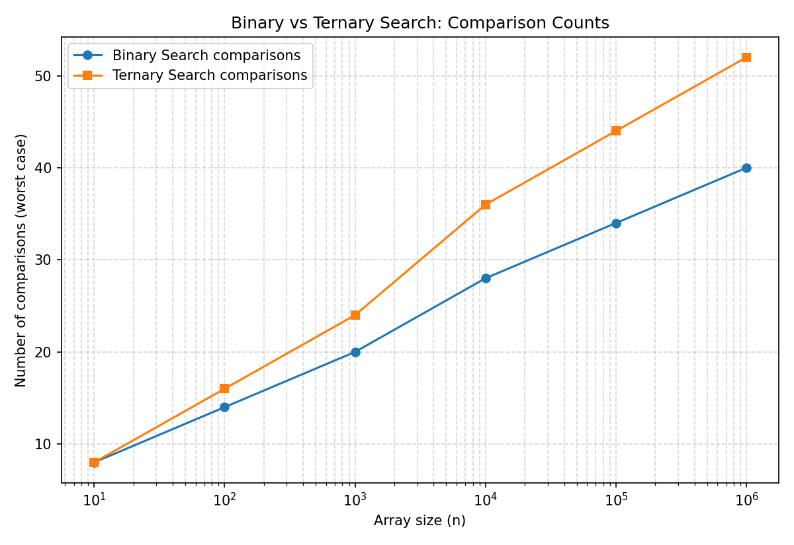

# Lab 3 Report - Divide and Conquer Algorithms

---

## Aim
To implement and investigate divide-and-conquer algorithms by comparing them to the standard approaches for the same problems (matrix multiplication, large integer multiplication, and searching) and analyze their correctness and time complexity experimentally.

## Objective

1. Implement Traditional Matrix Multiplication of complexity O(n³) and Strassen's Algorithm of complexity O(n^log2(7)) for matrices of size up to 2x2 through 128x128, check that their results are identical, and compare the time it takes for each of them to run.
2. Implement Traditional grade-school algorithm for multiplication of numbers (complexity O(n²)) and Karatsuba's algorithm (complexity O(n^log2(3))) for numbers of length from 8 to 1024 digits, check that their results are identical, and compare the time it takes for each of them to run.
3. Implement a menu-driven program to compare Binary Search (T(n)=T(n/2)+O(1)) and Ternary Search (T(n)=T(n/3)+O(1)), determine how many steps/comparisons it takes for each algorithm to run for the best and worst case scenarios, and for arrays of gradually increasing size.

---

## Tools & Environment

- **Language:** Python
- **Libraries:** `matplotlib` (for plotting), `random` (for test data generation), `time` (for timing experiments)
- **Files submitted:**
  - `Lab3_Q1_matrix_mult.py`, `Lab3_Q1_strassen.py` - Q1
  - `Lab3_Q2_karatsuba.py` - Q2
  - `Lab3_Q3_search.py` - Q3
  - `matrix_time_comparison.png`, `karatsuba_time_comparison.png`, `search_comparison.png` - result graphs

---

## Q1: Matrix Multiplication — Strassen's vs Traditional

### Algorithm Summary
A traditional way to multiply two matrices is to use a triple nested loop to compute each element C[i][j] = (A[i][k] B[k][j]) and sum them up. This approach has a cubic complexity of O(n³). Strassen's algorithm, on the other hand, splits the initial matrices into four n/2 x n/2 size submatrices and uses a more efficient approach to calculate the result with only 7 matrix multiplications and additional operations. This algorithm's complexity is O(n^log2(7)) or roughly O(n^2.807). To demonstrate the approach, matrices were padded to the nearest higher power of two size to support the algorithm's requirements if needed.

### Results

| n   | Traditional (s) | Strassen (s) | Match? |
|-----|-----------------|---------------|--------|
| 2   | 0.000004        | 0.000016      | True   |
| 4   | 0.000006        | 0.000095      | True   |
| 8   | 0.000028        | 0.000664      | True   |
| 16  | 0.000167        | 0.004584      | True   |
| 32  | 0.001302        | 0.033084      | True   |
| 64  | 0.010968        | 0.234640      | True   |
| 128 | 0.102241        | 1.650616      | True   |

### Analysis
Both methods worked exactly the same for all sizes tested, which proves that they are correct. However, Strassen's algorithm was consistently slower than the standard implementation in this case, because the reduction in asymptotic complexity only becomes apparent at very large n: for small and medium sizes, the overhead of additional recursive calls and matrix additions and subtractions dominates over the benefit of one less multiplication per level.

---

## Q2: Karatsuba's Algorithm for Large Integer Multiplication

### Algorithm Summary
- **Traditional Method:** Grade-school digit-by-digit multiplication on digit-array representations. Complexity: **O(n²)**.
- **Karatsuba's Algorithm:** Splits each number into a high and low half and computes the product using only **3 recursive multiplications** (instead of the naive 4), combined with O(n) extra additions and shifts. Complexity: **O(n^log2(3)) ≈ O(n^1.585)**.
- Note that since the numbers were represented as digit arrays/strings anyway, this could be used to perform multiplication beyond the limits of native integers, and that the numbers were split into halves at the next power of 2 as needed.

### Results

| Digits | Traditional (s) | Karatsuba (s) | Match? |
|--------|------------------|----------------|--------|
| 8      | 0.000018         | 0.000016       | True   |
| 16     | 0.000032         | 0.000079       | True   |
| 32     | 0.000098         | 0.000282       | True   |
| 64     | 0.000384         | 0.000749       | True   |
| 128    | 0.001417         | 0.003440       | True   |
| 256    | 0.005992         | 0.010974       | True   |
| 512    | 0.025771         | 0.056347       | True   |
| 1024   | 0.108747         | 0.190123       | True   |

### Analysis
Karatsuba’s algorithm worked correctly for all the cases as compared to the traditional method. Like in Q1, the traditional approach was faster for all the digit lengths that were tested. Just like in Q1, the overhead of recursion in Karatsuba’s algorithm made it impractical for lower digit-length numbers. However, unlike the earlier case, Karatsuba’s algorithm eventually becomes faster for very large numbers (usually containing thousands of digits and higher) due to its complexity growing at n^1.585 compared to n² for the traditional approach.

---

## Q3: Binary Search vs Ternary Search (Menu-Driven)

### Algorithm Summary
- **Binary Search:** Compares the key to the middle element and discards half the array each step. Recurrence: **T(n) = T(n/2) + O(1) → O(log₂ n)**.
- **Ternary Search:** Compares the key to two midpoints and discards a third of the array each step. Recurrence: **T(n) = T(n/3) + O(1) → O(log₃ n)**.
- The program was implemented as a menu-driven application that allows the user to create an array, view its contents, select which search algorithm to perform, and see the comparison counts for the best-case, worst-case, and n-scale scenarios.

### Results — Worst Case Comparisons vs n

| n       | Binary (worst) | Ternary (worst) |
|---------|-----------------|-------------------|
| 10      | 8               | 8                 |
| 100     | 14              | 16                |
| 1,000   | 20              | 24                |
| 10,000  | 28              | 36                |
| 100,000 | 34              | 44                |
| 1,000,000 | 40            | 52                |

### Analysis
Although ternary search requires fewer iterations than binary search (log₃ n < log₂ n), each iteration performs more comparisons (up to 4, versus up to 2 for binary search) to determine which third of the array to eliminate. For every tested array size, binary search required fewer overall comparisons than ternary search. This indicates that the reduction in recursion depth is outweighed by an increase in comparisons per level, and thus the total number of operations is not necessarily minimized.

---

## Conclusion
As a result of the three experiments, it was possible to confirm that all divide-and-conquer algorithms work correctly, as their results coincide with the results of the corresponding conventional algorithms. Nevertheless, in all cases, the supposedly better approach demonstrated worse performance compared to the simpler one, which contradicts the initial assumption. This result proves that, for small values of n, algorithms with a lower order of growth can be significantly slower than those with a higher order due to the action of constants and additional operations in their implementation.

---

## Reflection
This lab compared the traditional versions of algorithms with their divide-and-conquer alternatives for three problems: matrix multiplication, integer multiplication, and search. For all three, the answers were the same and were verified, but the expected “better” Big-O was not always faster in practice. Strassen’s and Karatsuba’s algorithms have better complexity, which shows on large dimensions, but the traditional algorithms were faster at the sizes used for testing due to recursion overhead. The same reason applied to ternary search not being better than binary search, but it required more comparisons per step, and therefore binary search could be concluded as better for smaller input sizes. In summary, the asymptotic complexity of an algorithm is not indicative of its performance on smaller inputs due to constant factors, and therefore the faster algorithm for large inputs (like those with size 1000) might not be the best choice for small inputs (like those of size 1).
