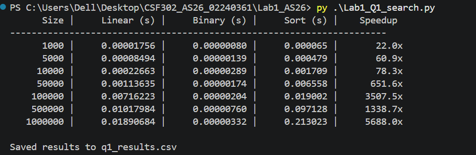
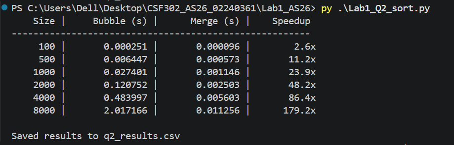
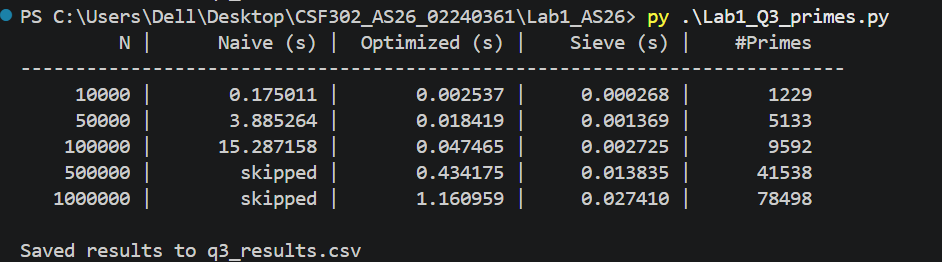

## Output
#### Question 1: Linear Search vs Binary Search

#### Question 2: Bubble Sort vs Merge Sort

#### Question 3: Prime Number Generation Algorithms

## Reflection
This lab demonstrated the practical implications of the theoretical complexities. For every experiment, the algorithm which had a better order of complexity significantly outperformed the other one, given a sufficiently large input size, even if the difference was not visible for small sizes. 

Binary search requires the array to be sorted in advance, which makes it useful only when multiple searches are made. The bubble sort’s time complexity grows roughly 4 times larger when input size doubles, while the merge sort’s complexity only grows by around 2.5 times, which matches with their respective complexities O(n2) and O(n log n). The biggest difference can be seen in the prime number generating algorithm, in which using a sieve of Eratosthenes allows for an enormous amount of time saved, as the complexity drops from roughly O(n2) to O(n log n) to O(n). 

Using the sieve over checking every number up to n for divisibility by all other numbers up to its square root becomes impossible at n = 105. Thus, two orders of complexity can be considered equal up to some value of n, but beyond that, their runtimes diverge significantly.
